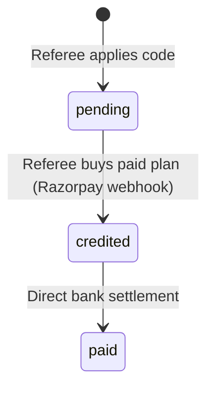

# PG Ease — Property Owner Referral APIs Specification

> **Base URL:** `https://am4eey3lmk.execute-api.ap-south-1.amazonaws.com/api`  
> **Authentication:** Bearer Token (`Authorization: Bearer <ACCESS_TOKEN>`)  
> **Content-Type:** `application/json`

---

## Overview

The PG Ease Referral System allows Property Owners to:
1. Generate and retrieve their unique referral code and shareable invite link.
2. Track referee signups, subscription conversions, and cash reward balances in real-time.
3. Apply a referrer code, invite link URL, or 10-digit mobile number upon joining.
4. Receive automated cash rewards (₹500 standard, ₹1,000 Pro/Enterprise) when a referred PG Owner purchases any paid subscription plan.

---

## 1. Get Owner Referral Summary (Primary API)

Returns full dashboard metrics including referral code, shareable link, earned rewards, pending rewards, total referees, and detailed referee history.

- **Method:** `GET`
- **Path:** `/property-owners/referral`
- **Authentication:** Required (`PropertyOwnerJwtAuthGuard`)

### Request Headers
```http
Authorization: Bearer <ACCESS_TOKEN>
```

### Response `200 OK` (Success with Data)
```json
{
  "success": true,
  "data": {
    "referralCode": "PGO-USER-5116",
    "shareableLink": "https://pgease.com/partner/signup?ref=PGO-USER-5116",
    "referredBy": "PGO-RAMESH-81F2",
    "totalEarned": 1500,
    "pendingRewards": 500,
    "totalReferees": 2,
    "rewardPolicy": {
      "standardPlanReward": 500,
      "proOrEnterprisePlanReward": 1000,
      "description": "Earn ₹500 - ₹1,000 automatically whenever a referred PG Owner purchases any paid subscription plan."
    },
    "referees": [
      {
        "id": "c1f7b8e2-45a1-4389-98de-99c687e83f01",
        "refereeName": "Ramesh Kumar",
        "refereePhone": "9876543210",
        "refereeType": "property_owner",
        "rewardAmount": 1000,
        "rewardStatus": "credited",
        "createdAt": "2026-09-20T10:15:30.000Z",
        "joinedAt": "2026-09-20T10:15:30.000Z",
        "creditedAt": "2026-09-22T14:20:00.000Z",
        "planName": "Growth Plan (Quarterly)"
      },
      {
        "id": "e4a2d1f9-89b3-4f28-bca7-11e548d91c02",
        "refereeName": "Amit Sharma",
        "refereePhone": "9812345678",
        "refereeType": "property_owner",
        "rewardAmount": 500,
        "rewardStatus": "pending",
        "createdAt": "2026-09-25T08:30:00.000Z",
        "joinedAt": "2026-09-25T08:30:00.000Z",
        "creditedAt": null,
        "planName": "PG Ease Subscription"
      }
    ]
  }
}
```

### Response `200 OK` (New Account with 0 Referees)
```json
{
  "success": true,
  "data": {
    "referralCode": "PGO-USER-5116",
    "shareableLink": "https://pgease.com/partner/signup?ref=PGO-USER-5116",
    "referredBy": null,
    "totalEarned": 0,
    "pendingRewards": 0,
    "totalReferees": 0,
    "rewardPolicy": {
      "standardPlanReward": 500,
      "proOrEnterprisePlanReward": 1000,
      "description": "Earn ₹500 - ₹1,000 automatically whenever a referred PG Owner purchases any paid subscription plan."
    },
    "referees": []
  }
}
```

### Response `401 Unauthorized`
```json
{
  "message": "Unauthorized",
  "statusCode": 401
}
```

---

## 2. Apply Referral Code to Owner Account

Applies an invite code, invite link URL, or 10-digit mobile number to link the caller's account to their referrer. Creates a `pending` referral record for reward tracking.

- **Method:** `POST`
- **Path:** `/property-owners/referral/apply`
- **Authentication:** Required (`PropertyOwnerJwtAuthGuard`)

### Request Headers
```http
Authorization: Bearer <ACCESS_TOKEN>
Content-Type: application/json
```

### Request Body
```json
{
  "referralCode": "PGO-RAMESH-81F2"
}
```

> **Supported Input Formats for `referralCode`:**
> 1. Canonical Code: `"PGO-RAMESH-81F2"`
> 2. Full Share URL: `"https://pgease.com/partner/signup?ref=PGO-RAMESH-81F2"`
> 3. 10-Digit Mobile: `"9876543210"` (resolves referrer by registered phone number)
> 4. Email: `"owner@pgease.com"` (resolves referrer by registered email)

### Response `200 OK` (Applied Successfully)
```json
{
  "success": true,
  "message": "Referral code PGO-RAMESH-81F2 applied successfully! Reward will be credited upon your first plan purchase.",
  "data": {
    "id": "9d8e7f6a-5b4c-3d2e-1f0a-8c7b6a5d4e3f",
    "referrerType": "property_owner",
    "referrerId": "6bc992dd-302f-45b7-a3de-366189c1b6e3",
    "referrerCode": "PGO-RAMESH-81F2",
    "refereeType": "property_owner",
    "refereeId": "261b9cc4-b588-4808-808b-2762aa9c5116",
    "refereeName": "user_6789",
    "refereePhone": "7701953356",
    "rewardAmount": "500.00",
    "rewardStatus": "pending",
    "planPurchaseId": null,
    "metadata": {
      "appliedAt": "2026-09-26T12:00:00.000Z",
      "referrerName": "Ramesh Kumar",
      "referrerPhone": "9876543210"
    },
    "createdAt": "2026-09-26T12:00:00.000Z",
    "creditedAt": null
  }
}
```

### Response `400 Bad Request` — Self-Referral Prevention
```json
{
  "message": "You cannot refer yourself",
  "error": "Bad Request",
  "statusCode": 400
}
```

### Response `400 Bad Request` — Already Applied
```json
{
  "message": "Referral code has already been applied for this account",
  "error": "Bad Request",
  "statusCode": 400
}
```

### Response `400 Bad Request` — Invalid Code / Referrer Not Found
```json
{
  "message": "Invalid referral code or referrer: INVALID-XYZ",
  "error": "Bad Request",
  "statusCode": 400
}
```

### Response `400 Bad Request` — Empty Code
```json
{
  "message": "Referral code is required",
  "error": "Bad Request",
  "statusCode": 400
}
```

---

## 3. Get My Referral Code & Share Link (Unified API)

Lightweight endpoint to fetch the owner's referral code and shareable URL.

- **Method:** `GET`
- **Path:** `/referrals/my-code`
- **Authentication:** Required (`ReferralUserJwtAuthGuard`)

### Request Headers
```http
Authorization: Bearer <ACCESS_TOKEN>
```

### Response `200 OK`
```json
{
  "success": true,
  "data": {
    "referralCode": "PGO-USER-5116",
    "shareUrl": "https://pgease.com/partner/signup?ref=PGO-USER-5116",
    "userType": "property_owner",
    "referredBy": null,
    "totalEarned": 1500,
    "pendingRewards": 500
  }
}
```

---

## 4. Get Referral Statistics (Unified API)

Summary statistics for dashboard widgets and quick metrics.

- **Method:** `GET`
- **Path:** `/referrals/stats`
- **Authentication:** Required (`ReferralUserJwtAuthGuard`)

### Request Headers
```http
Authorization: Bearer <ACCESS_TOKEN>
```

### Response `200 OK`
```json
{
  "success": true,
  "data": {
    "totalReferees": 2,
    "qualifiedReferees": 1,
    "totalRewardAmount": 1500,
    "pendingRewardAmount": 500,
    "referralCode": "PGO-USER-5116"
  }
}
```

---

## 5. Get Paginated Referees List (Unified API)

Returns a paginated list of referred users with status, plan name, and timestamps.

- **Method:** `GET`
- **Path:** `/referrals/list?page=1&limit=20`
- **Authentication:** Required (`ReferralUserJwtAuthGuard`)

### Query Parameters
| Parameter | Type | Default | Description |
| :--- | :--- | :--- | :--- |
| `page` | `number` | `1` | Page number (min 1) |
| `limit` | `number` | `20` | Items per page (max 100) |

### Request Headers
```http
Authorization: Bearer <ACCESS_TOKEN>
```

### Response `200 OK`
```json
{
  "success": true,
  "data": {
    "items": [
      {
        "id": "c1f7b8e2-45a1-4389-98de-99c687e83f01",
        "refereeName": "Ramesh Kumar",
        "refereePhone": "9876543210",
        "refereeType": "property_owner",
        "rewardAmount": 1000,
        "rewardStatus": "credited",
        "createdAt": "2026-09-20T10:15:30.000Z",
        "joinedAt": "2026-09-20T10:15:30.000Z",
        "creditedAt": "2026-09-22T14:20:00.000Z",
        "planName": "Growth Plan (Quarterly)"
      }
    ],
    "total": 1,
    "page": 1,
    "limit": 20,
    "totalPages": 1
  }
}
```

---

## 6. Unified Apply Referral Code

Alternate unified endpoint that routes to `applyOwnerReferralCode` when called with a Property Owner JWT.

- **Method:** `POST`
- **Path:** `/referrals/apply`
- **Authentication:** Required (`ReferralUserJwtAuthGuard`)

### Request Body
```json
{
  "referralCode": "PGO-RAMESH-81F2"
}
```

### Response `200 OK`
```json
{
  "success": true,
  "message": "Referral code PGO-RAMESH-81F2 applied successfully! Reward will be credited upon your first plan purchase.",
  "data": { ... }
}
```

---

## 7. Data Models & Payout Lifecycle

### Status Lifecycle


| Status | Meaning |
| :--- | :--- |
| `pending` | Referee registered and linked code; awaiting first subscription purchase. |
| `credited` | Referee successfully purchased a plan via Razorpay; reward credited to referrer's balance. |
| `paid` | Cash reward settled to referrer's bank account. |

### Reward Tiers
| Referee Subscription Plan | Referral Cash Reward |
| :--- | :--- |
| **Starter / Standard Plan** | **₹500.00** |
| **Growth / Pro / Enterprise Plan** (or $\ge$ ₹5,000) | **₹1,000.00** |

---

## 8. Frontend Types (`TypeScript`)

For consumption in `pg-owner-web-application/src/api/propertyOwner.ts`:

```typescript
export interface ReferralItem {
  id: string;
  refereeName: string;
  refereePhone: string;
  refereeType: "property_owner" | "tenant" | string;
  rewardAmount: number;
  rewardStatus: "pending" | "credited" | "paid" | string;
  planName: string | null;
  joinedAt: string;
  creditedAt: string | null;
}

export interface OwnerReferralSummary {
  referralCode: string;
  shareableLink: string;
  referredBy?: string | null;
  totalEarned: number;
  pendingRewards: number;
  totalReferees: number;
  rewardPolicy: {
    standardPlanReward: number;
    proOrEnterprisePlanReward: number;
    description: string;
  };
  referees: ReferralItem[];
}
```
